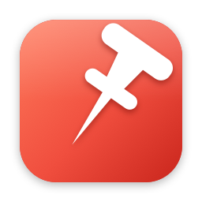
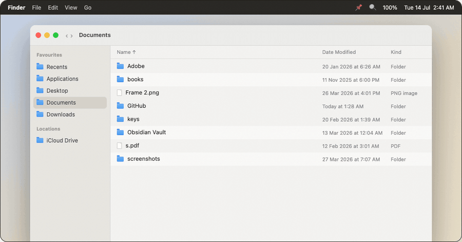
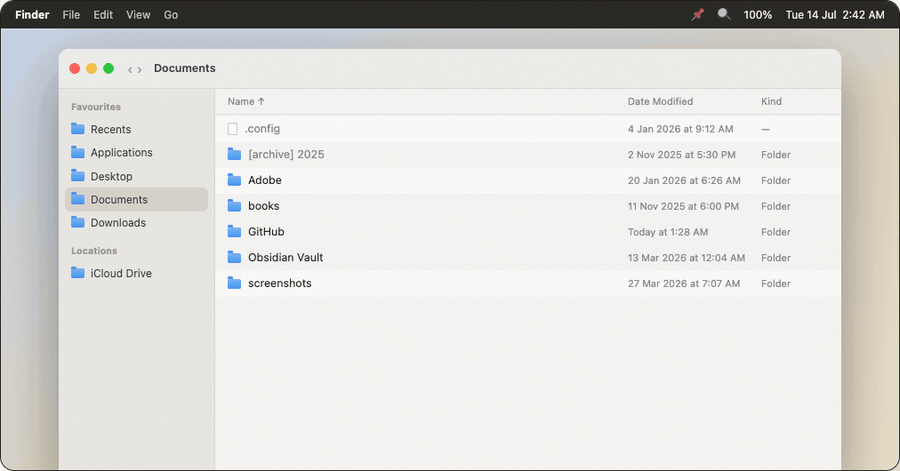
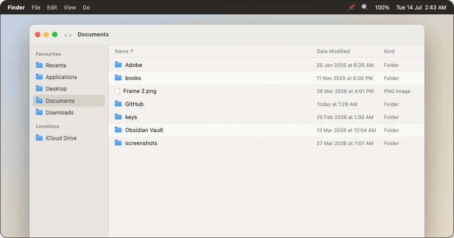

# PinFolder

Pin any file or folder on macOS — three ways, from one right-click.

<br clear="left">

**Website:** [sai-na.github.io/PinFolder](https://sai-na.github.io/PinFolder/)

Finder has no "pin" concept: you can't keep a favourite folder at the top of a
directory listing, and quick access means dragging things to the Dock or
sidebar by hand. PinFolder adds a tiny menu-bar app plus three Finder Quick
Actions that fix that:

| Right-click → Quick Actions | What it does |
|---|---|
| **📌 Pin** | Adds the item to the 📌 menu in the macOS menu bar — a global quick-open list. Folders open in Finder, files open in their default app. |
| **📌 Pin on Top** | Floats the item to the **top of its own folder** in Finder by creating a ` 📌 name` shortcut that sorts before everything else. The original is never renamed or touched. Run again to unpin. |
| **📌 Pin to Sidebar** | Toggles the item in the Finder sidebar **Favourites**. |

## See it in action

**📌 Pin — to the menu bar**



**📌 Pin on Top — to the top of its folder**



**📌 Pin to Sidebar — Finder Favourites**



Everything is stored in plain, inspectable places: the menu-bar list is a text
file (`~/.pinned-folders`, one path per line — edit it by hand any time), and
Pin on Top shortcuts are ordinary symlinks.

## Install

Requires the Xcode Command Line Tools (`xcode-select --install`). Everything
compiles locally in a few seconds, so there is no unsigned-binary Gatekeeper
dance.

**Homebrew:**

```bash
brew install sai-na/tap/pinfolder
pinfolder-setup
```

**Or from a clone:**

```bash
git clone https://github.com/sai-na/PinFolder.git
cd PinFolder
make install
```

A 📌 appears in the menu bar, and macOS shows three install prompts — click
**Install** on each to register the Quick Actions with Finder. If they don't
show up in the right-click menu afterwards, enable them once in
**System Settings → General → Login Items & Extensions → Extensions → Finder**
(or right-click → Quick Actions → Customise…).

The app starts at login by default. Change that — or turn on alphabetical
sorting for the pin list — in the 📌 menu → **Settings…**.

## Uninstall

**If you installed with Homebrew:**

```bash
pinfolder-setup uninstall   # removes the app + the three Quick Actions
brew uninstall pinfolder    # removes the Homebrew package
```

**If you installed from a clone:**

```bash
make uninstall
```

Both leave your own data alone — `~/.pinned-folders` (your pins list), any
` 📌 ` shortcut symlinks from Pin on Top, and sidebar Favourites entries.
They're just a text file, plain symlinks, and normal sidebar items: delete the
file, delete the symlinks, and right-click a sidebar entry → **Remove from
Sidebar** whenever you like.

## How it works

- **Menu-bar app** (`PinFolder.swift`, ~100 lines): a status-item menu that
  re-reads `~/.pinned-folders` every time it opens. No daemon, no database.
- **Pin on Top** (`pin-on-top.sh`): macOS has no API to reorder a Finder list,
  so the action creates a symlink whose name starts with a space + 📌 —
  whitespace collates before punctuation, digits, and letters under Finder's
  Name sort, so the shortcut lands at the very top. Only works when the folder
  is sorted by **Name, ascending, with groups off** (Finder remembers this per
  folder).
- **Pin to Sidebar** (`pinsidebar.m`): uses the deprecated-but-functional
  `LSSharedFileList` API — the same one the classic `mysides` tool uses.
- **Quick Actions** are generated as `.workflow` bundles by
  `make-workflows.py` — no Automator clicking involved.

See [BUILD.md](BUILD.md) for the full walkthrough and behaviour details.

## Caveats, honestly

- Pin on Top only beats a **Name ↑** sort. Sorted by Date/Size or grouped
  (View → Use Groups), the shortcut doesn't float.
- A pinned item appears twice in its folder (shortcut + original) — that's the
  price of never renaming your real files.
- The sidebar API is deprecated; if a future macOS removes it, the native
  fallback is selecting the folder and pressing ⌃⌘T (File → Add to Sidebar).

## Author

Built by **Sai Nath** — [LinkedIn](https://www.linkedin.com/in/sai-nath-849121221/) · [GitHub](https://github.com/sai-na)

## License

[MIT](LICENSE)
